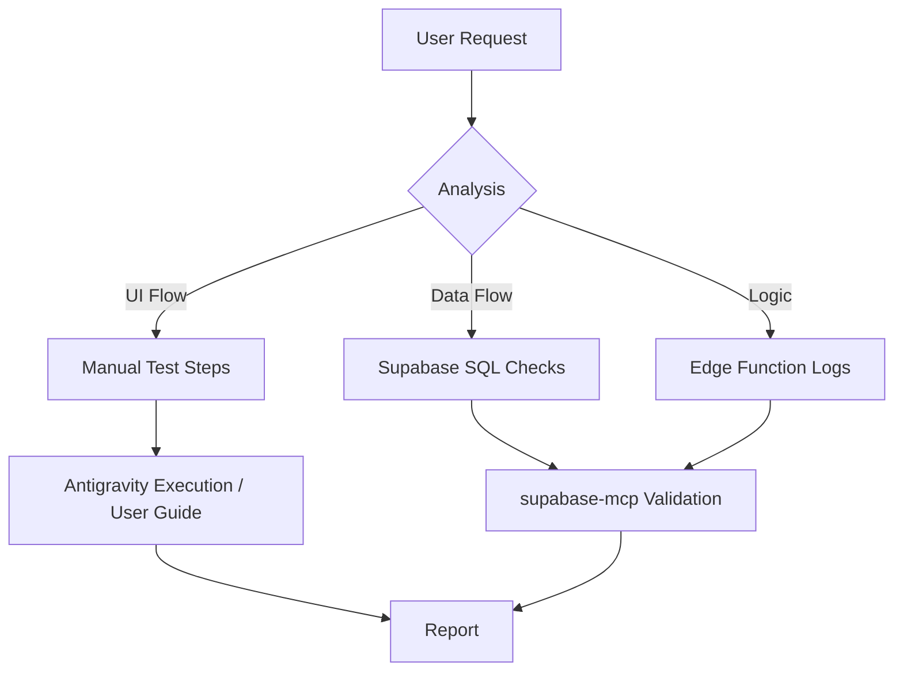

# QA Test Planner (Bloom Edition)

A specialized skill for **Bloom Mindful Companion**, designed to help Antigravity acting as a QA Engineer. It focuses on manual testing, database state verification (Supabase), and privacy-centric validation for mental health features.

> **Activation:** Triggered explicitly (e.g., `/qa-test-planner`, "create a test plan for...").

---

## Quick Start

**Plan a feature test:**
```
"Create a test plan for the PHQ-9 Assessment flow"
```

**Verify Backend State (Supabase):**
```
"Generate a verification workflow to check if user_sessions are created after a chat"
```

**Edge Case Analysis:**
```
"List potential edge cases for the Emergency SOS trigger in the chat"
```

---

## Core Capabilities for Antigravity

Since you are both the Planner and often the Explorer, this skill structures your testing sessions.

| Capability | Description | Tools Used |
| :--- | :--- | :--- |
| **Test Planning** | Strategy for CBT & Auth features | `sequential-thinking` |
| **Manual Test Cases** | Step-by-step for UI/UX | *Browser Tool* (if avail) |
| **DB Verification** | Checking `public` schema state | `supabase-mcp` |
| **Privacy Check** | Validating RLS & Data minimization | `supabase-mcp` |

---

## How It Works



---

## Core Deliverables

### 1. Test Plans (Bloom Specific)
*   **Context:** Mental Health focus (sensitive data).
*   **Scope:** UI (React/ShadCN), Backend (Supabase), AI (Edge Functions).
*   **Risk:** PII leakage, distress triggers, incorrect AI advice.

### 2. Manual Test Cases
*   **Format:** Step-by-step for Antigravity or User.
*   **Focus:**
    *   **Happy Path:** "User completes check-in."
    *   **Sad Path:** "Network fails during assessment submission."
    *   **Safety Path:** "User expresses self-harm (SOS trigger)."

### 3. Database Verification (Supabase MCP)
*   Instead of just "expecting" a result, **verify it** using SQL.
*   **Pattern:**
    1.  Perform Action (UI).
    2.  Query Database: `SELECT * FROM user_sessions WHERE user_id = '...' ORDER BY created_at DESC LIMIT 1`.
    3.  Assert: `status` should be `completed`.

---

## Workflows

### Workflow 1: Assessment Logic Validation
*   **Goal:** Ensure PSS/PHQ-9 scores are calculated and stored correctly.
*   **Steps:**
    1.  Design test input (e.g., "All answers = 3").
    2.  User/Antigravity performs flow.
    3.  **Validation:** Use `supabase-mcp` to query `assessments` table.
    4.  **Check:** Does `score` match expected sum? Are `tags` applied?

### Workflow 2: RLS & Privacy Audit
*   **Goal:** Ensure users can't see others' journals.
*   **Steps:**
    1.  Identify target table (e.g., `journal_entries`).
    2.  **Validation:** Attempt to `SELECT` data belonging to `User B` while authenticated as `User A` (or Anon).
    3.  **Success:** Query returns 0 rows or Access Denied.

### Workflow 3: Edge Function Debugging
*   **Goal:** Verify AI responses.
*   **Steps:**
    1.  Trigger function (chat message).
    2.  **Validation:** Use `supabase-mcp` to `get_logs` for `edge-function` service.
    3.  **Check:** Look for "Function Invoked" and specific log payloads.

---

## Templates

### Supabase Verification Step
```markdown
**Step X: Verify Database State**
*   **Action:** Check `[table_name]` for new record.
*   **Tool:** `supabase-mcp-server` -> `execute_sql`
*   **Query:**
    ```sql
    SELECT id, status, created_at
    FROM [table_name]
    WHERE user_id = '[test_user_id]'
    ORDER BY created_at DESC;
    ```
*   **Expected:** 1 row returned, status = 'active'.
```

### Bug Report (Antigravity Style)
```markdown
# BUG: [Concise Title]

**Severity:** High (Crash/Data Loss) | Medium (Function Broken) | Low (UI)
**Location:** [Component/Page] / [DB Table]

## Behavior
*   **Expected:** [What should happen]
*   **Actual:** [What happened]

## Evidence
*   **Logs:** (Paste from `get_logs`)
*   **State:** (Paste from `execute_sql`)

## Fix Strategy (Proposed)
*   [ ] Check RLS policy on `...`
*   [ ] Verify `handleSubmit` in `...tsx`
```

---

## Verification Checklist

**Before marking a feature "Tested":**
1.  [ ] **UI:** Does it look right? (Visual check)
2.  [ ] **State:** Is Supabase updated correctly? (SQL check)
3.  [ ] **Security:** are RLS policies active? (Permission check)
4.  [ ] **Performance:** Did the UI lag? Did the Edge Function timeout?
5.  [ ] **Safety:** (If AI) Did it adhere to safety guardrails?

---

"Trust, but verify. Then verify the verification with SQL."
