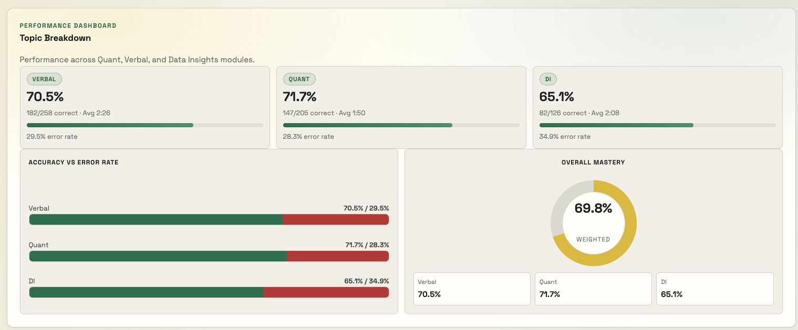

# GMAT Error Log

Local analytics app for GMAT Official Practice sessions.

## Product Intro

### 1) Performance Dashboard



### 2) Session Analysis and Wrong-Question Review


It connects to an already logged-in GMAT tab via Chrome CDP, runs the in-page scraper, stores results in SQLite, and provides:

- Session-level performance tracking
- Error log with annotation and sorting
- Topic/pattern analysis by subject/category/subtopic
- Session analysis modal with sortable wrong-question table
- One-click "Open question" inside the same CDP Chrome session
- LangGraph AI coach for performance review + Q&A over your GMAT data

## Tech Stack

- Backend: Node.js + Express (`src/server.js`)
- Scraper runtime: Playwright CDP bridge (`src/scraper-runner.js`)
- In-browser scraper: `src/scrapers/gmat_scraper.js`
- Database: SQLite (`data/gmat-error-log.db`)
- Frontend: React + Vite (`client/`)

## Repository Layout

```text
client/
  src/App.jsx                 Main dashboard UI
  src/styles.css              Global styles
src/
  server.js                   API routes + source presets + scrape windows
  db.js                       SQLite schema + analytics queries
  scraper-runner.js           CDP connection + scraper injection
  scrapers/gmat_scraper.js    GMAT in-page scraping logic
data/
  gmat-error-log.db           Local SQLite database
  chrome-cdp-profile/         Chrome profile used for CDP launch
```

## Requirements

- Node.js 20+ (LangChain/OpenAI package requirement)
- macOS if you want auto-launch via `Open Chrome (CDP)` button
- Google Chrome installed and able to log in to GMAT Official Practice

## Install

```bash
npm install
```

## Run

### Full local dev (API + web)

```bash
npm run dev
```

- Web: `http://localhost:5173`
- API: `http://127.0.0.1:4310`

### API only

```bash
npm run dev:api
```

### Web only

```bash
npm run dev:web
```

### Production-style run

```bash
npm run build:web
npm start
```

Then open `http://127.0.0.1:4310`.

## Scrape Workflow

1. Open the app and click **Sync GMAT Practice**.
2. Select a source preset.
3. Choose scrape period (`today`, `last3`, `last7`, `full`, `custom`).
4. Click **Open Chrome (CDP)** (macOS helper) or launch Chrome manually with CDP.
5. Make sure GMAT is logged in inside that same Chrome instance.
6. Click **Run Scrape + Save to DB**.

The backend:

- Resolves `since` in Thai timezone (`Asia/Bangkok`)
- Applies a safety buffer for `today` window (default 36 hours)
- Connects over CDP with loopback fallbacks (`localhost`, `127.0.0.1`, `::1`)
- Navigates to selected source URL before scraping
- Injects/executes `window.runScraper(...)` in page context
- Upserts session records and replaces question attempts for existing sessions

## Source Presets

Configured in `src/server.js`:

- `og-verbal-review-2024-2025`
- `og-quantitative-review-2024-2025`
- `og-data-insights-review-2024-2025`
- `og-main-2024-2025`
- `focus-quant-practice`
- `focus-verbal-practice`
- `focus-data-insights-practice`

Each preset includes:

- `id`, `label`, `appUrl`
- `clientId`
- optional `reviewCategoryId`
- `defaultSince`

## Timezone and Date Window Rules

- Primary timezone basis: `Asia/Bangkok` (ICT, UTC+7)
- `custom` accepts:
  - `YYYYMMDDHHmmss`
  - `YYYY-MM-DD`
  - `YYYY-MM-DDTHH:mm[:ss]`
- `today` uses buffer hours to avoid missing fresh sessions:
  - `SCRAPE_TODAY_BUFFER_HOURS` (env)
  - default `36`

## Key API Endpoints

- `GET /api/health`
- `GET /api/sources`
- `GET /api/runs`
- `GET /api/sessions?page=&pageSize=&runId=`
- `GET /api/sessions/:sessionId/analysis`
- `GET /api/errors?page=&pageSize=&runId=&subject=&difficulty=&topic=&confidence=&search=&sortKey=&sortOrder=`
- `GET /api/patterns?runId=`
- `PATCH /api/errors/:errorId` (save `mistakeType`, `notes`)
- `POST /api/open-chrome` (macOS Chrome launch helper)
- `POST /api/open-question` (open URL in connected CDP Chrome)
- `POST /api/scrape`
- `POST /api/ai/review` (LLM performance review for selected run/all runs)
- `POST /api/ai/chat` (LLM Q&A chatbot grounded on selected run/all runs)

## Database Model

Defined and migrated in `src/db.js`.

- `scrape_runs`
  - one row per scrape execution
  - stores source, since value, counts
- `sessions`
  - GMAT session-level aggregates
  - linked to latest run id on upsert
- `question_attempts`
  - one row per question attempt
  - includes `q_code`, `q_id`, `cat_id`, `question_url`, `subject_sub`, `topic`, answers, timing, annotations

Upsert behavior:

- Existing session is matched by `(session_external_id, source)` (latest record)
- Session stats are updated to current run
- Existing attempts for that session are deleted and reinserted

## Analytics Included

- Performance by session with difficulty splits (hard/medium/easy)
- Error log filters by subject/difficulty/topic/confidence/search
- Error log sorting (date, session, q code, subject, difficulty, topic, time, mistake type)
- Pattern dashboards:
  - by topic
  - by subject
  - by subject-topic
  - by difficulty
  - confidence mismatch
  - subject progress
  - category breakdown
  - subtopic breakdown
- Session analysis:
  - difficulty breakdown
  - wrong topics (all)
  - confidence performance
  - all wrong questions, sortable, with annotation/open actions

## Environment Variables

- `PORT` (default `4310`)
- `HOST` (default `127.0.0.1`)
- `CHROME_CDP_URL` (default `http://localhost:9222`)
- `SCRAPE_TODAY_BUFFER_HOURS` (default `36`)
- `EXPOSE_INTERNAL_DEBUG` (optional, default `false`; include internal scrape/CDP debug payloads in API responses)
- `ALLOW_REMOTE_CDP` (optional, default `false`; allow non-localhost CDP targets)
- `LLM_PROVIDER` (`openai` | `zai`, optional; auto-detect if omitted)
- `OPENAI_API_KEY` (required when provider is OpenAI)
- `OPENAI_MODEL` (optional, default `gpt-4o-mini`)
- `OPENAI_API_BASE` (optional custom OpenAI-compatible endpoint)
- `ZAI_API_KEY` (required when provider is Z AI)
- `ZAI_API_BASE` (optional for Z AI; default `https://api.z.ai/api/paas/v4/`)
- `ZAI_MODEL` (optional for Z AI, default `glm-5`)
- `LLM_TEMPERATURE` (optional, default `0.2`)
- `LLM_MAX_TOKENS` (optional, default `1000`)
- `CLASSIFIER_OPENAI_MODEL` / `CLASSIFIER_ZAI_MODEL` (optional classifier-only model override)

Coach and classifier now share the same provider, API key, base URL, temperature, and token settings. Only the model can differ for classification.

Example setup is included in `.env.example`.

## Troubleshooting

### `connect ECONNREFUSED ...:9222`

- Chrome CDP is not reachable.
- Use **Open Chrome (CDP)** or launch manually:

```bash
open -na "Google Chrome" --args --remote-debugging-port=9222
```

- Keep GMAT logged in inside that same Chrome instance.

### `No open GMAT tab found`

- Open any GMAT Official Practice page in the same CDP Chrome instance.

### AI review says `No response generated.`

- This is usually output-token exhaustion on long prompts.
- Remove or increase `LLM_MAX_TOKENS` in `.env`.
- Keep `LLM_DEBUG=1` temporarily to log response diagnostics in server console.

### Question "Open" goes to wrong context

- App preserves the source app path from stored `question_url` and rewrites only review hash.
- Re-scrape affected sessions if old rows were captured with incomplete routing data.

## Notes

- `public/` files are legacy static assets; active UI is the Vite React app in `client/`.
- No automated test suite is configured in current scripts.
