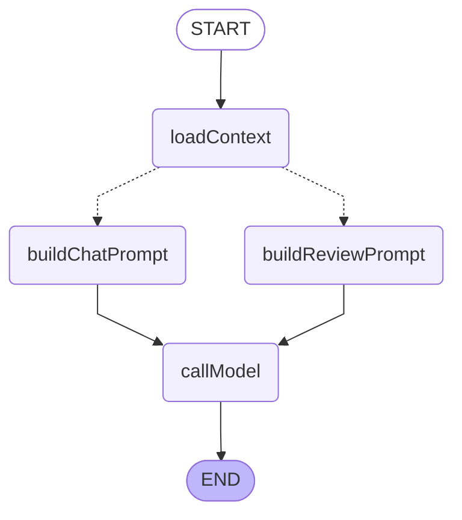

# Coach Graph

```mermaid
%%{init: {'flowchart': {'curve': 'linear'}}}%%
graph TD;
  START([START]):::first
  loadContext(loadContext)
  buildReviewPrompt(buildReviewPrompt)
  buildChatPrompt(buildChatPrompt)
  callModel(callModel)
  END([END]):::last
  START --> loadContext;
  buildChatPrompt --> callModel;
  buildReviewPrompt --> callModel;
  callModel --> END;
  loadContext -.-> buildReviewPrompt;
  loadContext -.-> buildChatPrompt;
  classDef default fill:#f2f0ff,line-height:1.2;
  classDef first fill-opacity:0;
  classDef last fill:#bfb6fc;
```
